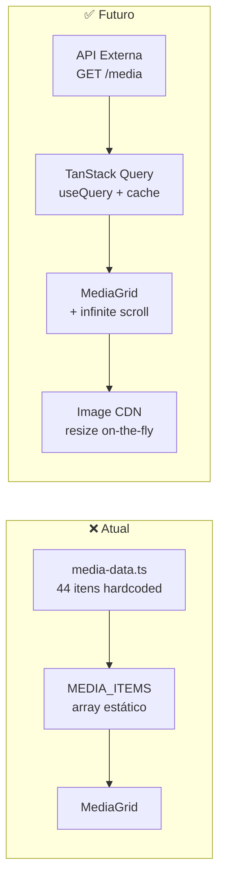

# 📊 Análise Técnica — Galeria AMBSSL (sert-o-galeria)

> **Data:** 24/04/2026  
> **Objetivo:** Avaliar a stack atual e propor melhorias para: mobile-first, experiência native-like, performance de mídia, e preparação para consumo de API externa.

---

## 1. Visão Geral da Stack Atual

| Camada | Tecnologia | Versão |
|--------|-----------|--------|
| Runtime | Node.js | 22.14.0 |
| Framework | TanStack Start (SSR/SSG) | 1.167.14 |
| UI Library | React | 19.2.0 |
| Router | TanStack Router | 1.168.0 |
| Build | Vite | 7.3.1 |
| Styling | Tailwind CSS v4 | 4.2.1 |
| Animations | Framer Motion | 12.38.0 |
| Deploy Target | Cloudflare Workers | wrangler.jsonc |
| Component Library | Radix UI (46 componentes shadcn/ui) | variados |
| State (server) | TanStack Query | 5.83.0 (instalado, **não utilizado**) |
| Validation | Zod | 3.24.2 |

### Arquitetura de Arquivos

```
src/
├── routes/          → 3 rotas (index, sobre, __root)
├── components/
│   ├── gallery/     → 9 componentes de negócio
│   └── ui/          → 46 componentes shadcn/ui
├── hooks/           → 4 hooks customizados
├── lib/             → media-data.ts (HARDCODED), utils.ts
├── assets/          → 1 arquivo (logo 95KB PNG)
└── styles.css       → Design system completo (oklch)
```

---

## 2. Bugs e Warnings Encontrados no Console

### 🔴 Críticos

| # | Problema | Arquivo | Impacto |
|---|---------|---------|---------|
| 1 | **favicon.ico 404** | `__root.tsx` | SEO penalizado, erro visível no console |
| 2 | **`'click' handler levou <N> ms`** (6x) | `MediaCard.tsx` | Jank perceptível ao tocar nos cards — bloqueia main thread |
| 3 | **Forced reflow (30-46ms)** | Render do Masonry | Layout thrashing ao abrir/fechar MediaViewer |

### 🟡 Warnings

| # | Problema | Arquivo | Impacto |
|---|---------|---------|---------|
| 4 | **`Missing Description` no DialogContent** (3x) | `sheet.tsx:63` | Acessibilidade (a11y) — leitores de tela sem descrição |
| 5 | **Preload não utilizado** (`picsum.photos/seed/ambssl-2/...`) | `MediaViewer.tsx:84-92` | Desperdício de banda — `<link rel="preload">` criado mas imagem não consumida a tempo |

---

## 3. Problemas de Performance — Imagens & Vídeos

### 3.1 Dados Hardcoded no Bundle

> [!CAUTION]
> **Todo o catálogo de 44 itens está hardcoded em [media-data.ts](file:///c:/Users/Usuario/Desktop/sert-o-galeria/src/lib/media-data.ts).** Isso significa que qualquer alteração no conteúdo exige re-deploy.

- A função `buildItems()` executa no **import** (tempo de parse do módulo)
- Gera URLs de `picsum.photos` (placeholder) — não são imagens reais
- **Sem paginação server-side** — todos os 44 itens carregam de uma vez na memória

### 3.2 Carregamento de Imagens — O que funciona ✅

O projeto já tem boas práticas implementadas:

- ✅ **LQIP (Low Quality Image Placeholder)** via blur de 24px (`lqipUrl`)
- ✅ **Lazy loading** com `IntersectionObserver` customizado no [MediaCard](file:///c:/Users/Usuario/Desktop/sert-o-galeria/src/components/gallery/MediaCard.tsx)
- ✅ **`srcSet` responsivo** com 4 breakpoints (320w–800w)
- ✅ **`content-visibility: auto`** nos cards (CSS containment)
- ✅ **Adaptação por rede** — `useNetwork()` reduz `rootMargin` em redes lentas
- ✅ **Shimmer skeleton** enquanto carrega
- ✅ **Paginação virtual** no grid (PAGE_SIZE = 14, sentinel observer)

### 3.3 Carregamento de Imagens — O que falta ❌

| Problema | Detalhe | Impacto |
|----------|---------|---------|
| **Sem formato moderno (WebP/AVIF)** | Todas URLs servem JPEG via picsum | +40-60% de tamanho desnecessário |
| **Sem CDN com image transforms** | URLs diretas ao servidor de origem | Sem cache edge, sem resize on-the-fly |
| **Logo PNG 95KB sem otimização** | [ambssl-logo.png](file:///c:/Users/Usuario/Desktop/sert-o-galeria/src/assets/ambssl-logo.png) (40x40 display) | Deveria ser SVG ou WebP ~5KB |
| **Preload desperdiçado** | `MediaViewer` cria `<link preload>` para vizinhos mas remove rápido demais | Warning no console, banda desperdiçada |
| **Sem `<picture>` element** | Usa `` sem fallback por formato | Perde oportunidade de servir AVIF → WebP → JPEG |
| **Sem cache headers** | Nenhuma config de cache no wrangler | Assets re-baixados a cada visita |

### 3.4 Carregamento de Vídeos — O que falta ❌

| Problema | Detalhe |
|----------|---------|
| **Vídeos de sample gigantes** | BigBuckBunny.mp4 = ~158MB, ElephantsDream = ~49MB |
| **Sem streaming adaptativo (HLS/DASH)** | Tag `<video src>` simples — ou baixa tudo ou falha |
| **Sem thumbnail de vídeo real** | Usa imagem do picsum como poster, não um frame real |
| **Sem `preload="none"` consistente** | Só aplica em rede lenta; em 4G baixa metadata de TODOS os vídeos |

---

## 4. Gaps para Experiência Mobile-First / Native-Like

### 4.1 O que já tem ✅

- ✅ Safe area insets (`env(safe-area-inset-*)`)
- ✅ `viewport-fit=cover` no meta
- ✅ `-webkit-tap-highlight-color: transparent`
- ✅ `overscroll-behavior-y: none`
- ✅ Bottom navigation com pill animado (Framer Motion)
- ✅ Swipe para navegar no viewer (drag gestures)
- ✅ Double-tap para favoritar
- ✅ Glass morphism no header e nav
- ✅ `prefers-reduced-motion` respeitado

### 4.2 O que falta ❌

| Gap | Prioridade | Detalhe |
|-----|-----------|---------|
| **Sem PWA / Service Worker** | 🔴 P0 | Sem `manifest.json`, sem cache offline, sem "Add to Home Screen" |
| **Sem Web App Manifest** | 🔴 P0 | Não aparece como app instalável no celular |
| **Click handlers lentos (>50ms)** | 🔴 P0 | `handleClick` no MediaCard usa `Date.now()` double-tap detection que bloqueia o main thread |
| **Sem haptic feedback** | 🟡 P1 | Favoritar/interações sem `navigator.vibrate()` |
| **Sem skeleton no first paint** | 🟡 P1 | 250ms de delay artificial (`setTimeout`) antes de mostrar conteúdo |
| **Sem pull-to-refresh** | 🟡 P2 | Esperado em galeria mobile nativa |
| **Sem transition entre rotas** | 🟡 P2 | Troca `/` → `/sobre` é abrupta |
| **Sem dark mode toggle** | 🟢 P3 | CSS preparado (`.dark`) mas sem UI para alternar |
| **Sem splash screen** | 🟢 P3 | Tela branca antes do React montar |

---

## 5. Peso do Bundle — Componentes Não Utilizados

> [!WARNING]
> **46 componentes shadcn/ui instalados, menos de 5 efetivamente utilizados.** O tree-shaking do Vite elimina o código não importado, mas os arquivos poluem o repositório e dificultam manutenção.

**Componentes realmente usados:**
- `sheet.tsx` (FilterSheet)
- `skeleton.tsx` (States)
- `sonner.tsx` (Toaster)

**Podem ser removidos (43 componentes):** accordion, alert-dialog, alert, aspect-ratio, avatar, badge, breadcrumb, button, calendar, card, carousel, chart, checkbox, collapsible, command, context-menu, dialog, drawer, dropdown-menu, form, hover-card, input-otp, input, label, menubar, navigation-menu, pagination, popover, progress, radio-group, resizable, scroll-area, select, separator, sidebar, slider, switch, table, tabs, textarea, toggle-group, toggle, tooltip.

---

## 6. TanStack Query — Instalado mas Não Usado

> [!IMPORTANT]
> `@tanstack/react-query v5.83.0` está no `package.json` mas **nenhum** `useQuery`, `useMutation` ou `QueryClient` existe no código.

Isso é a **peça fundamental** para a migração para API. Quando o endpoint chegar:
- Server state → TanStack Query
- Client state (favoritos) → mantém localStorage
- Cache → `staleTime` + `gcTime` configuráveis

---

## 7. Preparação para Consumo de API Externa

### 7.1 Estado Atual vs. Necessário



### 7.2 Contrato de Dados Sugerido (MediaItem)

O tipo `MediaItem` atual em [media-data.ts](file:///c:/Users/Usuario/Desktop/sert-o-galeria/src/lib/media-data.ts#L1-L17) já é bem estruturado. Sugestão de extensão para API:

```typescript
// Resposta esperada do endpoint
interface MediaApiResponse {
  data: MediaItem[];
  pagination: {
    page: number;
    pageSize: number;
    total: number;
    hasMore: boolean;
  };
}

// MediaItem estendido para API real
interface MediaItem {
  id: string;
  type: "photo" | "video";
  // URLs com CDN transform params
  thumbnailUrl: string;     // ?w=480&f=webp
  previewUrl: string;       // ?w=1000&f=webp
  fullUrl: string;          // original
  lqipUrl: string;          // ?w=24&blur=20&f=webp
  blurhash?: string;        // BlurHash string (alternativa ao LQIP)
  videoUrl?: string;
  // Dimensões para layout antes do carregamento
  width: number;
  height: number;
  aspectRatio: number;
  // Metadados
  caption?: string;
  createdAt: string;
  isFeatured?: boolean;
  authorName?: string;
  // Novos campos
  fileSize?: number;        // para mostrar ao baixar
  mimeType?: string;        // image/webp, video/mp4
  dominantColor?: string;   // placeholder CSS instantâneo
}
```

### 7.3 Checklist de Preparação

- [ ] Criar `src/lib/api.ts` com client HTTP (fetch wrapper)
- [ ] Criar `src/lib/query-client.ts` com configuração do TanStack Query
- [ ] Criar hook `useMediaItems()` com `useInfiniteQuery`
- [ ] Adicionar `QueryClientProvider` no `__root.tsx`
- [ ] Migrar `MediaGrid` de `items` prop para dados do query
- [ ] Implementar `staleTime: 5 * 60 * 1000` (5min cache)
- [ ] Adicionar error/loading states integrados ao query
- [ ] Configurar `retry: 2` para resiliência em mobile
- [ ] Variável de ambiente `VITE_API_BASE_URL` no `.env`

---

## 8. Plano de Ação Priorizado

### Fase 1 — Quick Wins (1-2 dias)

| # | Ação | Arquivo(s) | Esforço |
|---|------|-----------|---------|
| 1.1 | Adicionar `favicon.ico` / `favicon.svg` | `public/`, `__root.tsx` | 15min |
| 1.2 | Adicionar `aria-describedby` no SheetContent | `sheet.tsx` | 10min |
| 1.3 | Remover delay artificial de 250ms no mount | `index.tsx:57` | 5min |
| 1.4 | Otimizar logo PNG → SVG ou WebP comprimido | `assets/` | 30min |
| 1.5 | Remover 43 componentes UI não usados | `components/ui/` | 20min |

### Fase 2 — PWA & Native-Like (2-3 dias)

| # | Ação | Detalhe |
|---|------|---------|
| 2.1 | Criar `manifest.json` | name, icons, theme_color, display: standalone |
| 2.2 | Registrar Service Worker | Workbox ou vite-plugin-pwa |
| 2.3 | Implementar cache strategy | NetworkFirst para API, CacheFirst para assets |
| 2.4 | Adicionar splash screen | Via manifest + meta tags |
| 2.5 | Otimizar click handlers | Separar double-tap em `useDoubleTap()` hook com `requestAnimationFrame` |

### Fase 3 — Integração com API (3-5 dias)

| # | Ação | Detalhe |
|---|------|---------|
| 3.1 | Setup TanStack Query Provider | `QueryClient` com defaults otimizados |
| 3.2 | Criar `useMediaItems()` | `useInfiniteQuery` + cursor pagination |
| 3.3 | Migrar MediaGrid para infinite query | Substituir sentinel observer por `fetchNextPage` |
| 3.4 | Criar `useMediaItem(id)` | Para deep-link direto `?media=xxx` |
| 3.5 | Error boundaries por seção | Falha na API não derruba a app inteira |

### Fase 4 — Performance de Mídia (3-4 dias)

| # | Ação | Detalhe |
|---|------|---------|
| 4.1 | Implementar `<picture>` com AVIF/WebP | Fallback progressivo por formato |
| 4.2 | BlurHash no lugar de LQIP img | Placeholder CSS instantâneo, zero network |
| 4.3 | Configurar cache headers no Cloudflare | `Cache-Control: public, max-age=31536000, immutable` para assets |
| 4.4 | Lazy-load vídeos com poster real | Extrair primeiro frame como thumbnail |
| 4.5 | Implementar HLS para vídeos longos | `hls.js` com qualidade adaptativa |

---

## 9. Métricas-Alvo (Lighthouse Mobile)

| Métrica | Atual (estimado) | Meta |
|---------|-----------------|------|
| FCP (First Contentful Paint) | ~2.5s | < 1.2s |
| LCP (Largest Contentful Paint) | ~4.0s | < 2.5s |
| TBT (Total Blocking Time) | ~500ms | < 200ms |
| CLS (Cumulative Layout Shift) | ~0.15 | < 0.05 |
| TTI (Time to Interactive) | ~3.5s | < 2.0s |

---

## 10. Decisões para o Time Discutir

1. **CDN de imagens**: Vamos usar Cloudflare Images, Imgix, ou transformação no próprio Workers?
2. **Formato de vídeo**: MP4 direto ou HLS com múltiplas qualidades?
3. **Cache offline**: Quanto conteúdo cachear? Últimas 50 mídias? Somente favoritos?
4. **BlurHash vs LQIP**: BlurHash é mais leve (string de ~30 chars) mas precisa de decode no client. LQIP é uma img tiny mas requer request extra.
5. **Paginação da API**: Cursor-based (melhor para infinite scroll) ou offset-based (mais simples)?
6. **Autenticação**: O endpoint externo vai exigir token? Se sim, onde armazenar? (Cloudflare Workers proxy é o ideal)
