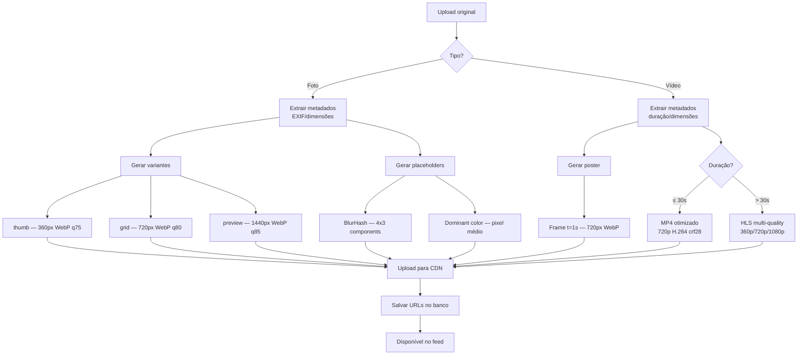

# 📡 API da Galeria — Spec para o Backend

> **Projeto:** Galeria Evento Vivo (sert-o-galeria)  
> **Data:** 24/04/2026  
> **De:** Time de Frontend  
> **Para:** Time de Backend  
> **Status:** Proposta para validação

---

## 1. Contexto

O frontend da galeria já está preparado para consumir uma API externa. Hoje roda com dados mock que simulam paginação por cursor. Quando o backend estiver pronto, basta configurar uma variável de ambiente (`VITE_API_BASE_URL`) e o app migra automaticamente.

O frontend usa **TanStack Query** com `useInfiniteQuery`, espera **paginação por cursor** (não offset), e faz cache agressivo no client (30s stale, 10min gc, offlineFirst).

> [!IMPORTANT]
> O gargalo da galeria em mobile **não é o request HTTP** — é o decode de imagem, peso de vídeo e layout. Por isso a API precisa devolver **variantes de mídia prontas** (thumb, grid, preview, original) em vez de apenas a URL do arquivo original.

---

## 2. Schema de Resposta — `GalleryMedia`

Este é o contrato que o frontend espera. Cada campo tem um motivo específico.

```jsonc
{
  // --- Identificação ---
  "id": "evt_m_abc123",          // ID único, prefixado por contexto
  "type": "photo",               // "photo" | "video"

  // --- Dimensões (obrigatórias) ---
  "width": 1600,                 // largura original em px
  "height": 1067,                // altura original em px
  "aspectRatio": 1.499,          // width/height — pré-calculado

  // --- Variantes de imagem (obrigatórias) ---
  "thumbUrl": "https://cdn.../thumb/abc123.webp",     // 240–360px
  "gridUrl": "https://cdn.../grid/abc123.webp",       // 480–720px
  "previewUrl": "https://cdn.../preview/abc123.webp", // 1080–1440px
  "originalUrl": "https://cdn.../original/abc123.jpg", // full-res (opcional)

  // --- Placeholder (pelo menos um) ---
  "blurhash": "LEHV6nWB2yk8pyoJadR*.7kCMdnj",       // BlurHash string
  "dominantColor": "#3a5a40",                          // hex da cor dominante

  // --- Vídeo (quando type === "video") ---
  "videoPosterUrl": "https://cdn.../poster/abc123.webp",   // frame real do vídeo
  "videoPreviewUrl": "https://cdn.../preview/abc123.mp4",  // mp4 curto ≤10s, ≤5MB
  "hlsUrl": "https://cdn.../hls/abc123/playlist.m3u8",     // HLS adaptativo
  "duration": 45,                                           // duração em segundos

  // --- Metadados ---
  "caption": "Festa junina da comunidade",
  "createdAt": "2026-04-20T15:30:00Z",    // ISO 8601
  "isFeatured": false,
  "authorName": "Maria Silva",
  "sponsorSlot": false                     // reservado para conteúdo patrocinado
}
```

### Tabela de Uso no Frontend

| Onde o frontend usa | Campo da API | Tamanho esperado |
|---------------------|-------------|-----------------|
| Grid mobile (2 colunas) | `thumbUrl` | 240–360px, WebP, ≤30KB |
| Grid desktop (3-4 colunas) | `gridUrl` | 480–720px, WebP, ≤80KB |
| Viewer (tela cheia) | `previewUrl` | 1080–1440px, WebP, ≤200KB |
| Download / Zoom real | `originalUrl` | Full-res, JPEG/PNG original |
| Placeholder instantâneo (CSS) | `dominantColor` | Hex string, 7 chars |
| Placeholder rico (canvas) | `blurhash` | String ~28 chars |
| Vídeo no grid | `videoPosterUrl` | Frame real, WebP, ≤50KB |
| Vídeo curto no viewer | `videoPreviewUrl` | MP4 ≤10s, ≤5MB |
| Vídeo longo no viewer | `hlsUrl` | HLS com múltiplas qualidades |

> [!WARNING]
> **Nunca mande `originalUrl` como única opção.** O frontend precisa das variantes menores para o grid. Se o backend só tiver o original, use Cloudflare Images ou similar para gerar as variantes em tempo real via URL transform.

---

## 3. Endpoints

### 3.1 `GET /media/feed` — Feed paginado

O endpoint principal. Retorna uma página do feed com cursor para infinite scroll.

#### Request

```
GET /media/feed?limit=14&sort=recent&cursor=eyJjIjoiMjAyNi0wNC0yMFQxNTozMDowMFoiLCJpZCI6ImV2dF9tX2FiYzEyMyJ9
```

| Param | Tipo | Default | Descrição |
|-------|------|---------|-----------|
| `limit` | int | 14 | Itens por página (max 50) |
| `sort` | string | `recent` | `recent` \| `featured` |
| `type` | string | — | `fotos` \| `videos` (filtra por tipo) |
| `cursor` | string | — | Cursor opaco para próxima página |
| `event_id` | string | — | Filtro por evento (multi-tenant futuro) |

#### Response `200 OK`

```json
{
  "data": [
    { /* GalleryMedia */ },
    { /* GalleryMedia */ }
  ],
  "nextCursor": "eyJjIjoiMjAyNi0wNC0xOVQwNzozMDowMFoiLCJpZCI6ImV2dF9tX3h5ejc4OSJ9",
  "total": 347
}
```

| Campo | Tipo | Descrição |
|-------|------|-----------|
| `data` | `GalleryMedia[]` | Array de itens da página atual |
| `nextCursor` | `string \| null` | Cursor para próxima página. `null` = última página |
| `total` | `number` | Total de itens no feed (para UI "X itens") |

> [!TIP]
> **Cursor-based > offset-based.** Offset quebra quando novos itens são inseridos entre páginas. Cursor garante consistência no infinite scroll. Um cursor simples é `base64(JSON({ createdAt, id }))`.

---

### 3.2 `GET /media/:id` — Mídia individual

Para deep links (`?media=evt_m_abc123`). Quando o usuário abre um link direto para uma mídia que não está na página atual do feed.

#### Request

```
GET /media/evt_m_abc123
```

#### Response `200 OK`

```json
{
  "data": { /* GalleryMedia completo */ }
}
```

#### Response `404 Not Found`

```json
{
  "error": {
    "code": "MEDIA_NOT_FOUND",
    "message": "Mídia não encontrada ou removida."
  }
}
```

---

### 3.3 `GET /media/new` — Polling de novas mídias (opcional)

Para o botão "12 novas fotos" sem resetar o scroll. O frontend faz polling leve a cada 30s.

#### Request

```
GET /media/new?since=2026-04-20T15:30:00Z&event_id=evt_123
```

| Param | Tipo | Descrição |
|-------|------|-----------|
| `since` | ISO 8601 | Timestamp do item mais recente no client |
| `event_id` | string | Evento atual |

#### Response `200 OK`

```json
{
  "count": 12,
  "data": [ /* GalleryMedia[] — só os novos */ ]
}
```

> [!TIP]
> Se o volume de mídias crescer muito, substituir polling por **SSE (Server-Sent Events)** ou **WebSocket**. O frontend está preparado para receber e inserir novas mídias no topo sem resetar.

---

### 3.4 `POST /media/:id/download` — Registrar download (analytics)

Não bloqueia o download — o frontend baixa direto do CDN. Esse endpoint é fire-and-forget para tracking.

```
POST /media/evt_m_abc123/download
Content-Type: application/json

{ "format": "original" }
```

Response: `204 No Content`

---

## 4. Paginação por Cursor — Como Implementar

### Estrutura do Cursor

```
cursor = base64url(JSON.stringify({ c: createdAt, i: id }))
```

### Query SQL (exemplo PostgreSQL)

```sql
-- Primeira página (sem cursor)
SELECT * FROM gallery_media
WHERE event_id = $1
ORDER BY created_at DESC, id DESC
LIMIT $2;

-- Páginas seguintes (com cursor)
SELECT * FROM gallery_media
WHERE event_id = $1
  AND (created_at, id) < ($cursor_created_at, $cursor_id)
ORDER BY created_at DESC, id DESC
LIMIT $2;
```

### Index necessário

```sql
CREATE INDEX idx_gallery_feed
  ON gallery_media (event_id, created_at DESC, id DESC);
```

> [!IMPORTANT]
> O cursor usa `(created_at, id)` como par porque `created_at` sozinho pode ter duplicatas. O `id` garante estabilidade.

---

## 5. Pipeline de Processamento de Mídia

Quando uma foto/vídeo é enviada, o backend deve processar e gerar todas as variantes antes de disponibilizar no feed.



### Recomendações de Processamento

| Variante | Formato | Qualidade | Resize | Peso alvo |
|----------|---------|-----------|--------|-----------|
| `thumbUrl` | WebP | 75 | 360px width, aspect ratio mantido | ≤30KB |
| `gridUrl` | WebP | 80 | 720px width | ≤80KB |
| `previewUrl` | WebP | 85 | 1440px width | ≤200KB |
| `originalUrl` | Original (JPEG/PNG) | — | sem resize | — |
| `videoPosterUrl` | WebP | 80 | 720px width | ≤50KB |
| `videoPreviewUrl` | MP4 H.264 | crf 28 | 720p | ≤5MB |
| `hlsUrl` | HLS (m3u8 + ts) | múltiplas | 360p/720p/1080p | segmentos 6s |

### BlurHash

```python
# Python (blurhash-python)
import blurhash
hash = blurhash.encode(image, x_components=4, y_components=3)
# Resultado: "LEHV6nWB2yk8pyoJadR*.7kCMdnj" (~28 chars)
```

```php
// PHP (kornrunner/blurhash)
use kornrunner\Blurhash\Blurhash;
$hash = Blurhash::encode($pixels, $width, $height, 4, 3);
```

### Cor Dominante

```python
# Python — média ponderada dos pixels centrais
from PIL import Image
img = Image.open(path).resize((1, 1))
r, g, b = img.getpixel((0, 0))
dominant = f"#{r:02x}{g:02x}{b:02x}"
```

---

## 6. Cloudflare Images — Alternativa Sem Pipeline

Se não quiser montar o pipeline de processamento, **Cloudflare Images** gera variantes via URL transform:

```
# Original
https://imagedelivery.net/{account_hash}/{image_id}/public

# Variantes por URL
https://imagedelivery.net/{account_hash}/{image_id}/w=360,f=webp,q=75   → thumbUrl
https://imagedelivery.net/{account_hash}/{image_id}/w=720,f=webp,q=80   → gridUrl
https://imagedelivery.net/{account_hash}/{image_id}/w=1440,f=webp,q=85  → previewUrl
```

Nesse caso, o backend armazena apenas o `image_id` e monta as URLs dinamicamente no response:

```php
// PHP — montar URLs no serializer
public function toGalleryMedia(): array
{
    $base = "https://imagedelivery.net/{$this->accountHash}/{$this->imageId}";
    
    return [
        'id'           => $this->id,
        'type'         => 'photo',
        'width'        => $this->width,
        'height'       => $this->height,
        'aspectRatio'  => round($this->width / $this->height, 3),
        'thumbUrl'     => "{$base}/w=360,f=webp,q=75",
        'gridUrl'      => "{$base}/w=720,f=webp,q=80",
        'previewUrl'   => "{$base}/w=1440,f=webp,q=85",
        'originalUrl'  => "{$base}/public",
        'dominantColor'=> $this->dominant_color,
        'blurhash'     => $this->blurhash,
        'caption'      => $this->caption,
        'createdAt'    => $this->created_at->toIso8601String(),
        'isFeatured'   => $this->is_featured,
        'authorName'   => $this->author_name,
    ];
}
```

> [!TIP]
> Cloudflare Images transforma e cacheia no edge automaticamente. Primeira request gera a variante, requests seguintes servem do cache. Excelente custo-benefício para galeria.

---

## 7. Headers de Cache Recomendados

O frontend tem Service Worker com cache por camadas. Os headers do backend devem complementar:

| Recurso | Header recomendado | Motivo |
|---------|-------------------|--------|
| `/media/feed` | `Cache-Control: public, max-age=30, stale-while-revalidate=60` | Feed muda com novas mídias, mas 30s de cache é aceitável |
| `/media/:id` | `Cache-Control: public, max-age=3600` | Mídia individual raramente muda |
| `/media/new` | `Cache-Control: no-cache` | Sempre precisa ser fresco |
| Imagens no CDN | `Cache-Control: public, max-age=31536000, immutable` | Imagens nunca mudam (URL muda se conteúdo muda) |

### ETag e Conditional Requests

```
# Response do backend
ETag: "abc123def456"
Cache-Control: public, max-age=30

# Request do frontend (via Service Worker)
If-None-Match: "abc123def456"

# Response se não mudou
304 Not Modified
```

---

## 8. Contrato de Erros

Formato padronizado para que o frontend mostre mensagens adequadas:

```json
{
  "error": {
    "code": "RATE_LIMITED",
    "message": "Muitas requisições. Tente novamente em 30 segundos.",
    "retryAfter": 30
  }
}
```

| HTTP Status | `code` | Quando usar |
|-------------|--------|-------------|
| 400 | `INVALID_PARAMS` | Query params inválidos (cursor malformado, limit > 50) |
| 404 | `MEDIA_NOT_FOUND` | Mídia não existe ou foi removida |
| 429 | `RATE_LIMITED` | Muitas requests (incluir `retryAfter`) |
| 500 | `INTERNAL_ERROR` | Erro inesperado no servidor |
| 503 | `SERVICE_UNAVAILABLE` | CDN/storage temporariamente fora |

---

## 9. Schema do Banco (sugestão)

```sql
CREATE TABLE gallery_media (
    id              VARCHAR(36) PRIMARY KEY,     -- UUID ou prefixado
    event_id        VARCHAR(36) NOT NULL,        -- FK para evento
    type            VARCHAR(10) NOT NULL,        -- 'photo' | 'video'
    
    -- Dimensões originais
    width           INT NOT NULL,
    height          INT NOT NULL,
    aspect_ratio    DECIMAL(6,3) NOT NULL,
    
    -- URLs das variantes (ou image_id se usar Cloudflare Images)
    storage_key     VARCHAR(255) NOT NULL,       -- key no S3/R2/CF Images
    thumb_url       VARCHAR(500),
    grid_url        VARCHAR(500),
    preview_url     VARCHAR(500),
    original_url    VARCHAR(500),
    
    -- Placeholders
    blurhash        VARCHAR(50),
    dominant_color  CHAR(7),                     -- #rrggbb
    
    -- Vídeo
    video_poster_url  VARCHAR(500),
    video_preview_url VARCHAR(500),
    hls_url           VARCHAR(500),
    duration          INT,                       -- segundos
    
    -- Metadados
    caption         VARCHAR(500),
    author_name     VARCHAR(100),
    is_featured     BOOLEAN DEFAULT FALSE,
    sponsor_slot    BOOLEAN DEFAULT FALSE,
    
    -- Controle
    status          VARCHAR(20) DEFAULT 'processing', -- processing | ready | failed
    file_size       BIGINT,                           -- bytes do original
    mime_type       VARCHAR(50),
    created_at      TIMESTAMP NOT NULL DEFAULT NOW(),
    updated_at      TIMESTAMP NOT NULL DEFAULT NOW(),
    deleted_at      TIMESTAMP,                        -- soft delete
    
    -- Indexes
    INDEX idx_feed (event_id, created_at DESC, id DESC),
    INDEX idx_feed_featured (event_id, is_featured, created_at DESC),
    INDEX idx_type (event_id, type, created_at DESC)
);
```

> [!IMPORTANT]
> **Só retorne mídias com `status = 'ready'` no feed.** Enquanto o pipeline de processamento roda (gerar thumbnails, blurhash, etc), o item fica com `status = 'processing'` e não aparece.

---

## 10. Checklist Antes do Deploy

- [ ] Endpoint `/media/feed` retorna `GalleryMedia[]` com todos os campos obrigatórios
- [ ] Paginação por cursor funcionando (não offset)
- [ ] `nextCursor` é `null` na última página
- [ ] `total` reflete o total real filtrado
- [ ] `aspectRatio` é pré-calculado no backend (`width / height`, 3 casas decimais)
- [ ] `dominantColor` é hex válido com `#` (ex: `#3a5a40`)
- [ ] `blurhash` tem pelo menos 4x3 components
- [ ] Variantes de imagem são WebP (com fallback JPEG se necessário)
- [ ] `videoPosterUrl` é um frame real do vídeo, não a thumbnail genérica
- [ ] `videoPreviewUrl` é MP4 ≤ 5MB para vídeos curtos
- [ ] `hlsUrl` aponta para playlist M3U8 válida
- [ ] `createdAt` está em ISO 8601 com timezone (`Z` ou offset)
- [ ] Headers `Cache-Control` configurados por rota
- [ ] CORS configurado para o domínio do frontend
- [ ] Erros seguem o formato `{ error: { code, message } }`
- [ ] Rate limiting configurado (sugestão: 60 req/min por IP)

---

## 11. Exemplo Completo — Request → Response

### Request

```http
GET /media/feed?limit=3&sort=recent&type=fotos HTTP/1.1
Host: api.eventovivo.com.br
Accept: application/json
```

### Response

```http
HTTP/1.1 200 OK
Content-Type: application/json
Cache-Control: public, max-age=30, stale-while-revalidate=60
ETag: "feed-v42"

{
  "data": [
    {
      "id": "evt_m_001",
      "type": "photo",
      "width": 1600,
      "height": 1067,
      "aspectRatio": 1.499,
      "thumbUrl": "https://cdn.eventovivo.com.br/media/evt_m_001/thumb.webp",
      "gridUrl": "https://cdn.eventovivo.com.br/media/evt_m_001/grid.webp",
      "previewUrl": "https://cdn.eventovivo.com.br/media/evt_m_001/preview.webp",
      "originalUrl": "https://cdn.eventovivo.com.br/media/evt_m_001/original.jpg",
      "blurhash": "LEHV6nWB2yk8pyoJadR*.7kCMdnj",
      "dominantColor": "#3a5a40",
      "caption": "Festa junina da comunidade",
      "createdAt": "2026-04-20T15:30:00Z",
      "isFeatured": true,
      "authorName": "Maria Silva",
      "sponsorSlot": false
    },
    {
      "id": "evt_m_002",
      "type": "photo",
      "width": 1200,
      "height": 1600,
      "aspectRatio": 0.75,
      "thumbUrl": "https://cdn.eventovivo.com.br/media/evt_m_002/thumb.webp",
      "gridUrl": "https://cdn.eventovivo.com.br/media/evt_m_002/grid.webp",
      "previewUrl": "https://cdn.eventovivo.com.br/media/evt_m_002/preview.webp",
      "dominantColor": "#dda15e",
      "caption": "Trilha ecológica com moradores",
      "createdAt": "2026-04-19T10:00:00Z",
      "isFeatured": false,
      "authorName": "João Pedro",
      "sponsorSlot": false
    },
    {
      "id": "evt_m_003",
      "type": "photo",
      "width": 1200,
      "height": 1200,
      "aspectRatio": 1.0,
      "thumbUrl": "https://cdn.eventovivo.com.br/media/evt_m_003/thumb.webp",
      "gridUrl": "https://cdn.eventovivo.com.br/media/evt_m_003/grid.webp",
      "previewUrl": "https://cdn.eventovivo.com.br/media/evt_m_003/preview.webp",
      "blurhash": "LKO2?U%2Tw=w]~RBVZRi};RPxuwH",
      "dominantColor": "#588157",
      "caption": "Plantio de mudas nativas",
      "createdAt": "2026-04-18T08:00:00Z",
      "isFeatured": false,
      "authorName": "AMBSSL",
      "sponsorSlot": false
    }
  ],
  "nextCursor": "eyJjIjoiMjAyNi0wNC0xOFQwODowMDowMFoiLCJpIjoiZXZ0X21fMDAzIn0",
  "total": 215
}
```
