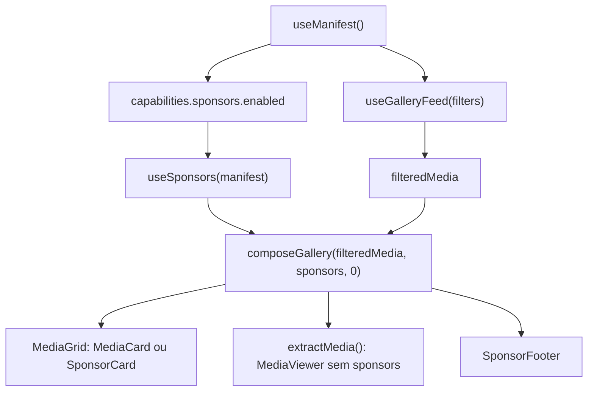

# Patrocinadores na galeria

> Projeto: `sert-o-galeria`  
> Data: 25/04/2026  
> Status: implementacao frontend concluida; pendencias de contrato backend

## Objetivo

Inserir os patrocinadores vindos do endpoint publico na galeria de fotos e videos como cards especiais do layout masonry, sem transformar patrocinador em midia real no banco e sem quebrar a experiencia mobile/PWA.

A regra central continua sendo:

```txt
media real entra como media
patrocinador entra como item composto de renderizacao
viewer, favoritos e download continuam trabalhando somente com media real
```

## Fontes oficiais consultadas

- MDN - Masonry layout: https://developer.mozilla.org/en-US/docs/Web/CSS/Guides/Grid_layout/Masonry_layout
- MDN - Intersection Observer API: https://developer.mozilla.org/en-US/docs/Web/API/Intersection_Observer_API
- web.dev - Lazy load images and iframe elements: https://web.dev/learn/performance/lazy-load-images-and-iframe-elements
- MDN - Responsive images: https://developer.mozilla.org/en-US/docs/Web/HTML/Guides/Responsive_images
- web.dev - Optimize Cumulative Layout Shift: https://web.dev/articles/optimize-cls
- TanStack Query - `useInfiniteQuery`: https://tanstack.com/query/latest/docs/framework/react/reference/useInfiniteQuery
- TanStack Query - Important defaults: https://tanstack.com/query/latest/docs/framework/react/guides/important-defaults
- TanStack Query - Network mode: https://tanstack.com/query/v5/docs/framework/react/guides/network-mode
- TanStack Router - Search params: https://tanstack.com/router/latest/docs/guide/search-params
- Vite - Env variables and modes: https://vite.dev/guide/env-and-mode
- MDN - Service workers: https://developer.mozilla.org/en-US/docs/Web/API/Service_Worker_API/Using_Service_Workers
- MDN - HTTP caching: https://developer.mozilla.org/en-US/docs/Web/HTTP/Guides/Caching
- MDN - Cache-Control header: https://developer.mozilla.org/en-US/docs/Web/HTTP/Reference/Headers/Cache-Control
- MDN - `Document.visibilityState`: https://developer.mozilla.org/en-US/docs/Web/API/Document/visibilityState
- MDN - `navigator.sendBeacon`: https://developer.mozilla.org/en-US/docs/Web/API/Navigator/sendBeacon
- React - `lazy`: https://react.dev/reference/react/lazy
- React - `Suspense`: https://react.dev/reference/react/Suspense
- React - `startTransition`: https://react.dev/reference/react/startTransition

## Stack atual observada

| Area         | Implementacao atual                                                  |
| ------------ | -------------------------------------------------------------------- |
| UI           | React 19.2 + TypeScript                                              |
| Build        | Vite 7 + `@vitejs/plugin-react`                                      |
| Rotas        | TanStack Router com search params validados por Zod                  |
| Server state | TanStack Query v5 com `useQuery` e `useInfiniteQuery`                |
| Layout       | `react-plock` para masonry responsivo                                |
| Estilo       | Tailwind CSS v4                                                      |
| Animacoes    | Framer Motion, com `MediaViewer` lazy-loaded                         |
| PWA          | Service worker manual em `public/sw.js` e `manifest.webmanifest`     |
| API          | `VITE_API_BASE_URL` + `VITE_EVENT_SLUG` em `src/lib/event-config.ts` |

Fluxo atual da pagina:



O endpoint real configurado hoje retorna patrocinadores ativos:

```txt
GET /public/events/1o-constelaco-dos-amigos/gallery/manifest
schema_version = "gallery-public-v1"
gallery.public_media_count = 36
gallery.published_version = 6
gallery.min_refresh_interval_seconds = 30
capabilities.sponsors.enabled = true
capabilities.sponsors.mode = "feed"
capabilities.sponsors.source = "wall_ads"
capabilities.realtime.enabled = false
capabilities.realtime.mode = "polling"
Cache-Control = "max-age=60, public, stale-while-revalidate=300"

GET /public/events/1o-constelaco-dos-amigos/gallery/sponsors
sponsors retornados em 25/04/2026: 24
Cache-Control = "max-age=60, public, stale-while-revalidate=300"

GET /public/events/1o-constelaco-dos-amigos/gallery/media-feed?limit=3
pagination.limit = 3
pagination.has_more = true
pagination.next_cursor = cursor opaco
pagination.media_start_index = ausente
Cache-Control = "max-age=30, public, stale-while-revalidate=120"
```

Formato atual do sponsor:

```ts
type GallerySponsor = {
  public_id: string;
  media_type: "image" | "video";
  mime_type: string | null;
  position: number;
  duration_seconds: number | null;
  display_duration_seconds: number | null;
  playback_mode: string;
  width: number | null;
  height: number | null;
  orientation: string | null;
  urls: {
    asset: string;
    poster: string | null;
  };
};
```

Campos importantes que ainda nao existem no contrato atual: `name`, `link_url`, `alt_text`, `status`, `placement`, `priority`, `weight`, `starts_at`, `ends_at`, `max_impressions`, `impression_count`, `click_count` e variantes responsivas do asset.

Resumo das lacunas reais do endpoint atual:

| Area                  | Estado atual                             | Consequencia no frontend                                                                                |
| --------------------- | ---------------------------------------- | ------------------------------------------------------------------------------------------------------- |
| Dimensoes de sponsor  | `width` e `height` chegam `null`         | usar fallback fixo `16 / 9` para reservar espaco                                                        |
| Variantes responsivas | nao ha `responsive_sources` em sponsors  | baixar `urls.asset` direto ate o backend evoluir                                                        |
| Nome/alt/link         | ausentes                                 | alt generico e card sem navegacao externa por enquanto                                                  |
| Regras comerciais     | ausentes no manifest                     | usar defaults locais, mas modelar `sponsor_rules` agora                                                 |
| Offset global         | ausente em `pagination`                  | `maxPages` pode quebrar sequencia se paginas antigas sairem                                             |
| Analytics             | URLs ausentes                            | implementar hook pronto para endpoint, mas no-op se capability nao existir                              |
| Cache                 | feed 30s/SWR 120s, sponsors 60s/SWR 300s | bom para funcionamento atual; pedir TTL maior para sponsors quando assets/metadados ficarem versionados |

## Diagnostico da implementacao atual

O que ja esta correto:

- Sponsors e midias ja chegam por endpoints separados.
- `composeGallery` ja cria uma lista composta com `kind: "media"` e `kind: "sponsor"`.
- `MediaViewer` ja usa `extractMedia`, entao patrocinador nao entra no viewer.
- `MediaGrid` renderiza sponsor como card proprio dentro do masonry.
- `SponsorFooter` ja cobre sponsors que nao apareceram inline.
- `SponsorCard` ja usa `IntersectionObserver` com `threshold: 0.5` e atraso de 1s, que e a base certa para impressao real.
- `useInfiniteQuery` ja pagina o feed de midia por cursor.
- `QueryClient` ja usa `networkMode: "offlineFirst"`, coerente com PWA e service worker.

Riscos e melhorias necessarias:

| Risco                                        | Onde                         | Impacto                                                                                          |
| -------------------------------------------- | ---------------------------- | ------------------------------------------------------------------------------------------------ |
| Chave duplicada quando sponsor entra em loop | `composedItemId`             | `sponsor-A` aparece mais de uma vez e cria conflito de React key                                 |
| Offset global ainda fixo em `0`              | `routes/index.tsx`           | se `maxPages` remover paginas antigas, os sponsors reiniciam a sequencia                         |
| Regras hardcoded                             | `compose-gallery.ts`         | frequencia e modo nao acompanham regra comercial do evento                                       |
| Sem ordenacao robusta                        | `compose-gallery.ts`         | hoje depende da ordem da API; deveria usar `position`, depois `priority/weight` quando existirem |
| Top banner sempre aparece                    | `routes/index.tsx`           | com inline + footer, vira tres exposicoes por sponsor                                            |
| Card nao usa link/nome/alt                   | `SponsorCard.tsx`            | quando o backend enviar link, o frontend nao aproveita; acessibilidade fica generica             |
| Video sponsor nao tem tratamento proprio     | `SponsorCard.tsx`            | `media_type: "video"` pode chegar, mas o card renderiza como imagem                              |
| Impressao nao e enviada                      | `SponsorCard.tsx`            | hoje so muda estado visual; falta endpoint/analytics                                             |
| Footer depende so dos itens carregados       | `compose-gallery.ts`         | com paginacao longa, pode mostrar no footer sponsor que apareceu em pagina descartada            |
| Sem testes unitarios do composer             | `src/lib/compose-gallery.ts` | regressao facil em casos de 0, 3, 12, 50 midias e muitos sponsors                                |
| Cache de sponsors curto                      | backend                      | sponsor muda pouco; `max-age=60` gera refetch mais frequente do que precisa                      |
| Sem dimensoes de sponsor                     | backend/UI                   | precisa fallback de proporcao para evitar layout shift                                           |

## Decisao arquitetural

Para a stack atual, a melhor decisao e manter a composicao no frontend por enquanto.

Motivos:

- A API atual ja separa `/media-feed` e `/sponsors`.
- O app ja tem TanStack Query, cache e paginacao no cliente.
- O viewer e os favoritos precisam continuar ignorando sponsors.
- A mesma regra pode ser testada como funcao pura em `src/lib/compose-gallery.ts`.

Quando houver mais de um cliente consumindo a mesma galeria, o backend pode passar a devolver uma lista ja composta. Mesmo nesse caso, o banco deve continuar separando midia real de sponsor; a composicao deve acontecer no serializer/API, nao no modelo de midia.

## Regra de produto recomendada

```txt
Default:
  sponsor_frequency = 5
  min_media_for_inline = 5
  sponsor_mode = "inline_and_footer"
  sponsor_order = "position_then_priority_then_weighted_rotation"
  sponsor_loop = true

Se nao houver sponsors:
  renderizar apenas midias

Se houver menos de 5 midias carregadas:
  nao inserir sponsor inline
  mostrar sponsors no footer

Se houver mais sponsors do que slots inline:
  usar slots inline para os primeiros elegiveis
  mandar os restantes para "Apoiadores do evento"

Se houver mais slots inline do que sponsors:
  repetir sponsors em loop estavel

Se a aba for "favoritos":
  recomendacao: nao inserir inline por padrao
  opcional: manter footer se houver exigencia comercial
```

Sobre o `SponsorBanner` do topo: ele deve ficar atras de uma regra explicita, por exemplo `sponsor_mode = "header_inline_footer"` ou `placement: "header"`. No modo sugerido `inline_and_footer`, o topo deve ser removido para evitar excesso de publicidade.

## Modelo de dados alvo

O frontend pode aceitar estes campos de forma opcional para manter compatibilidade com o endpoint atual:

```ts
type SponsorPlacement = "header" | "inline" | "footer" | "both";

type GallerySponsor = {
  public_id: string;
  name?: string;
  alt_text?: string;
  link_url?: string | null;
  media_type: "image" | "video";
  mime_type: string | null;
  position: number;
  priority?: number;
  weight?: number;
  placement?: SponsorPlacement;
  status?: "active" | "inactive";
  starts_at?: string | null;
  ends_at?: string | null;
  max_impressions?: number | null;
  impression_count?: number;
  click_count?: number;
  display_duration_seconds: number | null;
  width: number | null;
  height: number | null;
  orientation: string | null;
  urls: {
    asset: string;
    poster: string | null;
  };
  responsive_sources?: {
    sizes: string;
    srcset: string;
    variants: Array<{
      variant_key: string;
      src: string;
      width: number;
      height: number;
      mime_type: string;
    }>;
  } | null;
};
```

Regras do evento podem vir no manifest:

```json
{
  "gallery": {
    "sponsor_rules": {
      "frequency": 5,
      "min_media_for_inline": 5,
      "mode": "inline_and_footer",
      "order": "position_then_priority_then_weighted_rotation",
      "loop": true,
      "max_weight": 10
    }
  }
}
```

Se o backend ainda nao enviar `sponsor_rules`, o frontend usa defaults locais.

## Algoritmo proposto

### 1. Normalizar sponsors

Antes de compor a galeria:

```txt
1. remover sponsor sem urls.asset
2. se status existir, manter apenas active
3. se starts_at/ends_at existirem, validar janela de exibicao
4. se max_impressions existir, remover se impression_count >= max_impressions
5. separar por placement:
   - inline: entra no meio da galeria
   - footer: entra so no footer
   - both/undefined: pode entrar inline e footer se nao for usado
6. ordenar por:
   - priority asc, se existir
   - position asc
   - public_id asc como desempate estavel
7. criar pool ponderado por weight:
   - weight undefined = 1
   - weight minimo = 1
   - weight maximo = config.max_weight, default 10
```

Exemplo de pool:

```txt
A weight 3
B weight 1
C weight 1

pool = A, A, A, B, C
```

### 2. Compor itens

O item composto de sponsor precisa carregar metadados do slot, nao apenas o sponsor:

```ts
type ComposedSponsorItem = {
  kind: "sponsor";
  data: GallerySponsor;
  placement: "inline";
  slotIndex: number;
  slotId: string;
  afterMediaId: string;
};
```

Pseudo-codigo:

```ts
function composeGallery(media, sponsors, config, context) {
  const normalized = normalizeSponsors(sponsors, config);
  const result = [];
  const usedSponsorIds = new Set<string>();

  if (!normalized.inline.length) {
    return {
      items: media.map((data) => ({ kind: "media", data })),
      footerSponsors: normalized.footer,
    };
  }

  if (media.length < config.minMediaForInline && context.mediaStartIndex === 0) {
    return {
      items: media.map((data) => ({ kind: "media", data })),
      footerSponsors: normalized.footer,
    };
  }

  for (const [localIndex, item] of media.entries()) {
    result.push({ kind: "media", data: item });

    const globalPosition = context.mediaStartIndex + localIndex + 1;
    const shouldInsert = globalPosition % config.frequency === 0;

    if (!shouldInsert) continue;

    const slotIndex = Math.floor(globalPosition / config.frequency) - 1;
    const sponsor = normalized.weightedInlinePool[slotIndex % normalized.weightedInlinePool.length];
    const slotId = [
      "inline",
      context.filterKey,
      String(slotIndex),
      String(globalPosition),
      sponsor.public_id,
    ].join(":");

    result.push({
      kind: "sponsor",
      data: sponsor,
      placement: "inline",
      slotIndex,
      slotId,
      afterMediaId: item.id,
    });

    usedSponsorIds.add(sponsor.public_id);
  }

  return {
    items: result,
    footerSponsors: normalized.footer.filter((s) => !usedSponsorIds.has(s.public_id)),
  };
}
```

### 3. Chaves React

Nunca usar so `sponsor.public_id` como key, porque o mesmo sponsor pode aparecer varias vezes em loop.

```ts
export function composedItemId(item: ComposedItem): string {
  if (item.kind === "media") return `media-${item.data.id}`;
  return `sponsor-${item.slotId}`;
}
```

### 4. Paginacao e offset global

Hoje `composeGallery(filteredMedia, sponsors ?? [], 0)` funciona enquanto `filteredMedia` sempre comeca no primeiro item carregado da sessao.

O risco aparece por causa de `maxPages: 10` no `useInfiniteQuery`. A documentacao do TanStack Query descreve que `maxPages` limita as paginas guardadas e pode remover paginas antigas conforme novas paginas entram. Se a pagina 1 for descartada, a lista achatada pode comecar na midia 301, mas o composer ainda acha que comeca na midia 1.

Opcoes:

```txt
Opcao A - simples agora:
  remover maxPages ou deixar ilimitado enquanto a galeria tiver volume moderado.

Opcao B - robusta:
  backend retorna media_start_index ou absolute_rank por pagina.
  frontend passa mediaStartIndex para composeGallery.

Opcao C - intermediaria:
  frontend mantem contador de paginas descartadas.
  mais fragil com cursor e filtros.
```

Recomendacao: usar Opcao A no curto prazo e planejar Opcao B no contrato do backend.

### 5. Tempo real sem salto visual

Como o feed esta em ordem recente primeiro, a regra mais segura para PWA mobile e:

```txt
1. polling ou realtime detecta novas midias
2. UI mostra "X novas fotos chegaram"
3. usuario toca no aviso
4. app refaz query e recompoe a galeria
```

Nao inserir automaticamente no topo enquanto o usuario esta rolando. Isso evita perda de posicao e reposicionamento agressivo do masonry.

Se no futuro existir uma visualizacao "antigas primeiro", novas midias podem ser adicionadas no fim e o composer insere sponsor quando completar mais um bloco de 5 midias.

## Card de sponsor

Requisitos do `SponsorCard`:

- usar `aspect-ratio` real quando `width/height` vierem da API; fallback `16 / 9`;
- renderizar imagem com `loading="lazy"` e `decoding="async"`;
- usar `srcSet` e `sizes` quando o backend enviar variantes;
- usar `alt_text` ou `name`; fallback `"Apoiador do evento"`;
- se `link_url` existir, renderizar `<a href target="_blank" rel="sponsored noopener noreferrer">`;
- se nao houver link, renderizar elemento nao clicavel para nao sugerir acao inexistente;
- exibir selo discreto `"Apoiador do evento"`;
- para `media_type: "video"`, preferir poster/thumbnail no masonry; autoplay inline so deve ser adotado se houver regra comercial explicita e budget de performance;
- disparar click analytics antes/depois da navegacao com `sendBeacon` ou `fetch(..., { keepalive: true })`;
- manter dimensoes estaveis para evitar CLS.

## Impressao e analytics

Regra recomendada:

```txt
Contar impressao quando:
  pelo menos 50% do card ficou visivel
  por pelo menos 1000ms
  a aba estava visivel
  o mesmo slot ainda nao foi contado nesta sessao
```

O ID de deduplicacao deve ser o `slotId`, nao apenas o sponsor:

```txt
inline:todos:0:5:wall_sponsor_x
inline:fotos:4:25:wall_sponsor_y
footer:todos:wall_sponsor_z
```

Endpoints sugeridos:

```http
POST /public/events/:slug/gallery/sponsors/:public_id/impression
Content-Type: application/json

{
  "slot_id": "inline:todos:0:5:wall_sponsor_x",
  "placement": "inline",
  "visible_ratio": 0.5,
  "visible_ms": 1000
}
```

```http
POST /public/events/:slug/gallery/sponsors/:public_id/click
Content-Type: application/json

{
  "slot_id": "inline:todos:0:5:wall_sponsor_x",
  "placement": "inline",
  "href": "https://patrocinador.example"
}
```

## Cache e performance

Regras recomendadas:

| Recurso                      | Estrategia                                                                                                                                        |
| ---------------------------- | ------------------------------------------------------------------------------------------------------------------------------------------------- |
| HTML/app shell               | `no-cache` + ETag, porque nao tem URL com hash                                                                                                    |
| JS/CSS Vite com hash         | `Cache-Control: public, max-age=31536000, immutable`                                                                                              |
| `/media-feed`                | manter curto; endpoint real ja usa `max-age=30, stale-while-revalidate=120`                                                                       |
| `/sponsors`                  | hoje usa `max-age=60, stale-while-revalidate=300`; alvo recomendado: `max-age=300, stale-while-revalidate=3600` quando metadados ficarem estaveis |
| asset de sponsor versionado  | cache longo, `max-age=31536000, immutable`                                                                                                        |
| analytics de impressao/click | `no-store`                                                                                                                                        |

O endpoint atual ja usa asset com query de versao, por exemplo:

```txt
/storage/wall/events/376/ads/01.jpg?v=b7d1fd0414bc497b
```

Isso e bom para cache forte, desde que a versao mude quando a imagem mudar.

O service worker atual nao intercepta cross-origin, entao assets e API de `api.eventovivo.com.br` dependem dos headers HTTP/CDN. Essa decisao evita falsos problemas de CORS e deve ser mantida, salvo se houver proxy same-origin no futuro.

Para evitar CLS, sponsor inline precisa reservar espaco antes da imagem carregar. Como o endpoint atual retorna `width` e `height` nulos, o fallback de producao deve ser `aspect-ratio: 16 / 9`. Quando o backend passar dimensoes reais, a UI deve usar `width / height`. Essa regra segue a recomendacao de reservar espaco para conteudo carregado tarde, especialmente anuncios/embeds.

```tsx
const aspectRatio =
  sponsor.width && sponsor.height ? `${sponsor.width} / ${sponsor.height}` : "16 / 9";
```

## Configuracao TanStack Query por endpoint

A configuracao atual e funcional, mas pode ficar mais precisa por tipo de dado:

| Query              | Estado atual                                   | Ajuste recomendado                                                                  |
| ------------------ | ---------------------------------------------- | ----------------------------------------------------------------------------------- |
| `gallery-manifest` | `staleTime: 60_000`, `gcTime: 10min`           | manter ou subir para 2-5min se o manifest nao muda durante o evento                 |
| `gallery-sponsors` | `staleTime: 5min`, `gcTime: 10min`, `retry: 1` | subir `gcTime` para 30min; manter `staleTime` >= cache HTTP do endpoint             |
| `gallery-feed`     | `staleTime: 30s`, `maxPages: 10`               | manter `staleTime`; remover `maxPages` no curto prazo ou exigir `media_start_index` |
| analytics          | ainda nao existe                               | usar mutation/fire-and-forget, sem retry agressivo                                  |

`networkMode: "offlineFirst"` faz sentido na stack atual porque o app tem service worker e usa cache HTTP. O cuidado e nao tratar query pausada/offline como erro fatal de galeria.

## Seguranca e privacidade

Melhorias obrigatorias antes de ativar link e analytics:

- validar `link_url` no backend e aceitar apenas `https://`;
- bloquear `javascript:`, `data:`, URLs malformadas e redirects suspeitos;
- links externos devem usar `target="_blank"` com `rel="sponsored noopener noreferrer"`;
- nao colocar segredos em `VITE_*`; Vite expoe essas variaveis no bundle do cliente;
- endpoints publicos de impression/click devem ter rate limit;
- payload de analytics nao deve carregar PII; usar `event_slug`, `public_id`, `slot_id`, `placement` e session id anonimo de curta duracao, se necessario;
- CSP recomendada: `connect-src` para API, `img-src` para API/CDN de assets, `media-src` para videos e sem liberar dominios arbitrarios vindos de sponsor;
- se `link_url` vier de cadastro administrativo, sanitizar e revisar no painel antes de publicar.

## Plano de implementacao

### Fase 1 - Correcao de base

Arquivos principais:

- `src/lib/compose-gallery.ts`
- `src/routes/index.tsx`
- `src/components/gallery/MediaGrid.tsx`
- `src/hooks/use-gallery.ts`

Tarefas:

- [x] adicionar `slotId`, `slotIndex`, `placement` e `afterMediaId` ao tipo `ComposedSponsorItem`;
- [x] alterar `composedItemId` para usar `slotId`;
- [x] ordenar sponsors por `priority ?? position`, depois `position`, depois `public_id`;
- [x] manter fallback atual se a API ainda nao enviar `priority` e `weight`;
- [x] tornar `SPONSOR_FREQUENCY` e `MIN_MEDIA_FOR_INLINE` configuraveis por objeto;
- [x] decidir se a aba `favoritos` mostra footer apenas ou nenhum sponsor;
- [x] condicionar `SponsorBanner` ao modo `header` em vez de renderizar sempre.
- [x] remover `maxPages: 10` no curto prazo ou manter apenas depois que `media_start_index` existir no backend.

### Fase 2 - Composer robusto e testado

Adicionar testes unitarios para:

- [x] 0 sponsors;
- [x] menos de 5 midias;
- [x] 12 midias e 3 sponsors;
- [x] 50 midias e 3 sponsors;
- [x] 15 midias e 6 sponsors;
- [x] sponsor com `weight > 1`;
- [x] sponsors com `placement: "footer"`;
- [x] key unica quando o mesmo sponsor aparece em loop;
- [x] `mediaStartIndex` diferente de 0.

Se o projeto nao quiser adicionar runner agora, a opcao minima e incluir Vitest:

```txt
npm install -D vitest
```

E script:

```json
{
  "scripts": {
    "test": "vitest run"
  }
}
```

### Fase 3 - Card, acessibilidade e links

Arquivos principais:

- `src/components/gallery/SponsorCard.tsx`
- `src/components/gallery/SponsorFooter.tsx`
- `src/lib/gallery-media.ts`

Tarefas:

- [x] aceitar `slotId` no card;
- [x] usar `link_url` quando existir;
- [x] usar `name`/`alt_text` quando existirem;
- [x] usar dimensoes reais para `width`, `height` e `aspectRatio`;
- [x] tratar sponsor de video como poster estatico no masonry;
- [x] adicionar estado de erro de imagem com fallback visual simples;
- [x] garantir que o card sem link nao seja anunciado como link/clickable;
- [x] manter label de transparencia `"Apoiador do evento"`.
- [x] adicionar campos opcionais no tipo `GallerySponsor` sem quebrar o contrato atual.

### Fase 4 - Impressao e click tracking

Arquivos sugeridos:

- `src/hooks/use-sponsor-impression.ts`
- `src/lib/sponsor-analytics.ts`
- `src/lib/api.ts`

Tarefas:

- [x] criar hook com `IntersectionObserver`;
- [x] exigir 50% de visibilidade por 1000ms;
- [x] pausar contagem quando `document.visibilityState !== "visible"`;
- [x] deduplicar por `slotId` em `sessionStorage`;
- [x] enviar impressao com `navigator.sendBeacon` quando possivel;
- [x] usar `fetch` com `keepalive: true` como fallback;
- [x] ignorar analytics se endpoint nao existir no manifest.
- [x] nao retentar agressivamente analytics; falha nao pode afetar renderizacao da galeria.

### Fase 5 - Contrato do backend

Pedir ao backend:

- [ ] incluir `gallery.sponsor_rules` no manifest;
- [ ] incluir `capabilities.sponsors.impression_url` e `capabilities.sponsors.click_url`;
- [ ] preencher `name`, `alt_text`, `link_url`, `placement`, `priority`, `weight` quando existirem no cadastro;
- [ ] retornar variantes responsivas para assets de sponsor;
- [ ] retornar `width` e `height` dos banners;
- [ ] expor endpoints de impressao e click;
- [ ] retornar `media_start_index` ou `absolute_rank` para pagina robusta com `maxPages`;
- [ ] configurar cache headers por tipo de recurso.
- [ ] validar `link_url`, rate-limit em analytics e nao retornar campos privados do cadastro.

### Fase 6 - Tempo real

Tarefas:

- [x] se `capabilities.realtime.enabled`, implementar indicador de novas midias;
- [x] nao recompor automaticamente no topo em feed recente-primeiro;
- [x] usar `startTransition` ao aplicar filtro/recompor lista grande;
- [x] manter posicao do scroll quando o usuario decide atualizar.

## Contrato de API sugerido

Manifest:

```json
{
  "capabilities": {
    "sponsors": {
      "enabled": true,
      "mode": "feed",
      "url": "https://api.eventovivo.com.br/api/v1/public/events/slug/gallery/sponsors",
      "source": "wall_ads",
      "impression_url": "https://api.eventovivo.com.br/api/v1/public/events/slug/gallery/sponsors/{public_id}/impression",
      "click_url": "https://api.eventovivo.com.br/api/v1/public/events/slug/gallery/sponsors/{public_id}/click"
    }
  },
  "gallery": {
    "sponsor_rules": {
      "frequency": 5,
      "min_media_for_inline": 5,
      "mode": "inline_and_footer",
      "order": "position_then_priority_then_weighted_rotation",
      "loop": true
    }
  }
}
```

Sponsors:

```json
{
  "success": true,
  "schema_version": "1.1",
  "sponsors": [
    {
      "public_id": "wall_sponsor_abc",
      "name": "Empresa ABC",
      "alt_text": "Logo da Empresa ABC",
      "link_url": "https://empresa.example",
      "media_type": "image",
      "position": 1,
      "priority": 1,
      "weight": 3,
      "placement": "both",
      "status": "active",
      "starts_at": null,
      "ends_at": null,
      "max_impressions": null,
      "width": 1280,
      "height": 720,
      "urls": {
        "asset": "https://cdn.example/sponsors/abc.v3.webp",
        "poster": null
      },
      "responsive_sources": {
        "sizes": "(max-width: 640px) 50vw, (max-width: 1200px) 33vw, 25vw",
        "srcset": "https://cdn.example/sponsors/abc-480.webp 480w, https://cdn.example/sponsors/abc-960.webp 960w",
        "variants": []
      }
    }
  ],
  "meta": {
    "request_id": "req_123",
    "generated_at": "2026-04-25T22:00:00Z",
    "sponsors_enabled": true
  }
}
```

Media feed com offset robusto:

```json
{
  "media": [],
  "pagination": {
    "limit": 30,
    "next_cursor": "opaque",
    "has_more": true,
    "media_start_index": 0
  }
}
```

## Criterios de aceite

- Com 0 sponsors, a galeria renderiza apenas fotos/videos.
- Com menos de 5 midias, nenhum sponsor aparece inline.
- Com 12 midias e 3 sponsors, entram sponsors apos a midia 5 e 10; o terceiro vai para footer.
- Com 50 midias e 3 sponsors, a sequencia faz loop estavel.
- Com 60 sponsors e poucas fotos, a galeria nao vira uma parede de anuncios; excedentes ficam no footer.
- Sponsors nunca entram no `MediaViewer`.
- Keys React continuam unicas quando o mesmo sponsor aparece mais de uma vez.
- Infinite scroll nao reinicia sponsor se paginas antigas forem descartadas.
- Impressao e contada uma vez por `slotId`, apenas apos 50% por 1s.
- `npm run typecheck` passa.
- `npm run build` passa.

## Ordem recomendada de execucao

```txt
1. corrigir keys/slotId e remover duplicidade do banner de topo
2. remover maxPages ou exigir media_start_index antes de depender dele
3. transformar composer em funcao configuravel e testada
4. enriquecer tipos opcionais para futuro contrato
5. melhorar SponsorCard/SponsorFooter com aspect-ratio, srcset e fallback
6. adicionar analytics de impressao/click com dedupe por slotId
7. adicionar seguranca para link_url, VITE_* e endpoints publicos
8. alinhar backend: sponsor_rules, metadados, cache, analytics e offset global
9. implementar aviso de novas fotos sem salto visual
```
